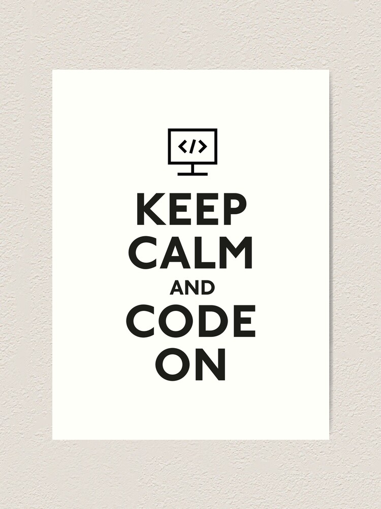
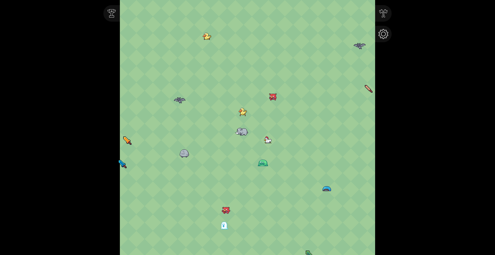
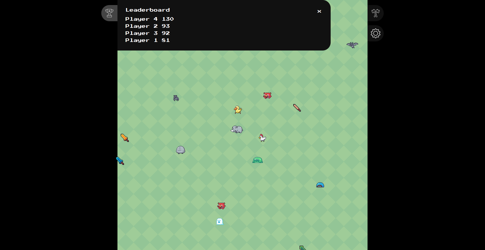
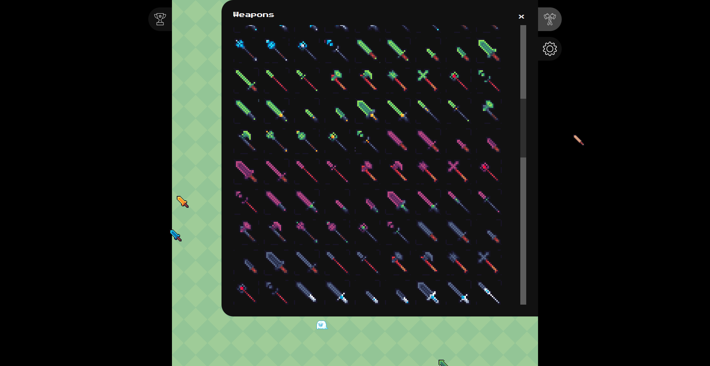
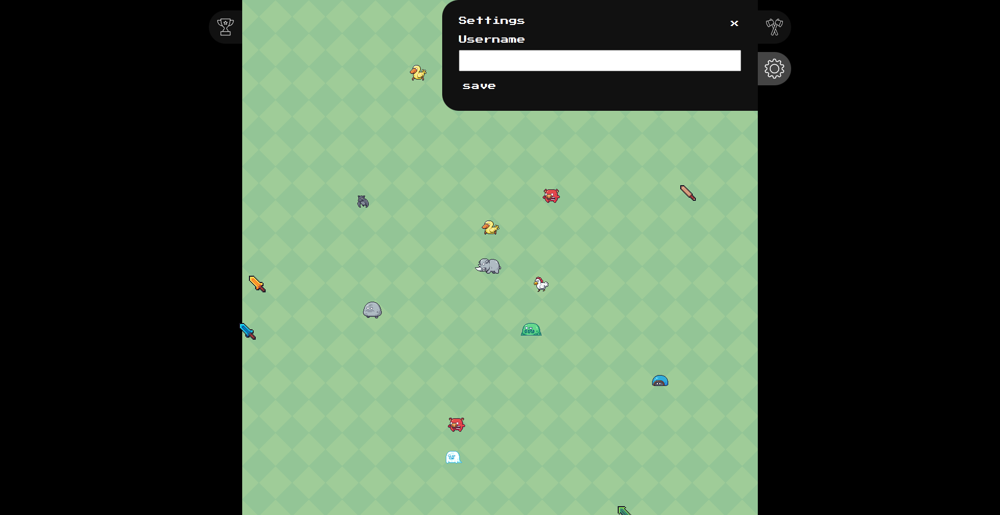

# App/y Innovations Fullstack Assignment

## Preamble

This assignment is difficult! It is okay if you cannot figure some things out or cannot finish all the features. The important thing is that you demonstrate your process and try your best.

## Your task

Build a full stack system according to the examples below. Your task is to complete the front-end and back-end of this project to provide a fast and intuitive experience for the user. The result will be a multiplayer web-based video game that is compatible with all form factors and device types. This assignment is not just assessing your technical skill, but your ability to collaborate with our team. Throughout this assignment, feel free to contact us to discuss your thoughts, ideas and struggles.

## Setup

To get started you must setup your development environment by installing the required dependencies:

- Clone this repository
- Make sure [npm](https://www.npmjs.com/get-npm) is installed
- Make sure [yarn](https://classic.yarnpkg.com/en/docs/install) is installed

We recommend using [Visual Studio Code](https://code.visualstudio.com/) to write your code however you can use any code editor.

## Workspace

This project uses [yarn workspaces](https://classic.yarnpkg.com/lang/en/docs/workspaces) which allows us to manage inter-dependent packages in a convienient fashion.

To get the template running you must run the following in the project root:

- `yarn install`
- `yarn start`

The `backend` folder contains all the code required to provide the backend services for the web app.

The `frontend` folder contains all the code required to interact with the application.

The `types` folder contains the common types that are shared between the front-end and back-end.

You can access the common types using `import { } from '@apply/types'`.

## Design

This assignment contains a dynamically sized view that is usable and resizable to **all realistic screen sizes**. You are allowed to improve the usability of design if you wish, however the design should be simple, intuitive and work on any device (both touch and desktop). Below are some examples from one solution we have built. You do not have to follow this design exactly, however your implementation should be clean, consistent and bug-free.

All of the image assets for this project are stored in the `frontend/public/assets` folder, there are additional assets if you would like to use them, however you are not expected to use all the images provided.

The screens you will have to complete include:
| Type | Example |
| ------ | ----- |
| Game | 
| Leaderboard | 
| Weapons | 
| Settings | 

You can view a screen recording of all the features [here](https://drive.google.com/file/d/1m_TwjP4lWbsGV4UbZA7MT7i4NHPq5uAP/view?usp=sharing).

## User features

- The user should have a weapon for a cursor
- The user should be able to see enemies on the game area
- The user should be able to click to swing their weapon
- The user should be able to see other users weapons on the game area
- The user should be able to see other users swinging their weapon
- If the user swings their weapon on an enemy, they should see the enemy get damaged and get points
- The user should be able to see their total score in the leaderboard
- The user should be able to change their username in the settings menu
- The user should be able to change their weapon through a weapon selector menu

You are welcome to add features of your own for extra wow factor if desired!

## Already provided

- All the backend logic with enemy scoring, movement and player hits
- The backend is implemented using [socket.io](https://socket.io/docs/v4) in order to provide a real-time connection between all users
- Types shared by the frontend and backend (feel free to extend these if needed)
- Components to render sprites that are animated according to their sprite sheet
- Yarn workspace dependencies
- Initial config to use a socket.io backend and react frontend
- The font file has been included in `index.css`

## Requires implementation

- All our css styles have been removed from the app, some classes used by the provided components will have to be written
- Implement some form of state management to access data throughout the frontend (context and hooks)
- Implement the backend function to manage users: setting user position, adding users, removing users, setting a username
- Animate the movement of the enemies between positions using css animations at the velocity provided by the backend
- Animate the local player cursor
- Animate the other users cursors on the game area
- Implement all frontend and backend socket methods for player related actions
- Implement the different panels and information/interactions on each
- Rendering entities (enemies and weapons) on the game

## Assessment Criteria

| Criteria           | Description                                                                                                                                                                                                                                                           |
| ------------------ | --------------------------------------------------------------------------------------------------------------------------------------------------------------------------------------------------------------------------------------------------------------------- |
| Typescript         | We expect all of the code to be completely type-safe. This might require use of generics and code specific to typescript. All the communication between the frontend and backend should be described by the types within the `types` folder (`@apply/types` package). |
| Use of components  | To ensure your work is following best practices we recommend creating many small custom react components instead of copying and pasting common code throughout your work.                                                                                             |
| Speed of UI        | Your implementation must feel responsive to the user. If the user performs actions that have to wait for the backend to respond, be sure to include an animation so that the flow feels natural.                                                                      |
| Simplicity of code | Your code must be readable and clear. In places where your code is not clear please use comments to explain those sections. Unessecarily complicated / convoluted code will be marked down.                                                                           |

## Tips
- `x` and `y` are relative coordinates to the entity's position within the game area. Both values are between 0 and 1 where `x=0, y=0` is the top left and `x=1, y=1` is the bottom right.
- Please do not use JQuery, you will be marked down significantly for using this
- This project has been completed by our lead engineers and they did not require any additional npm packages to do so
- Please email alexander@applyinnovations.com.au with any questions or assitance required. Asking questions always reflects **positivley** on your assessment (even if you are asking for help)
- We are expecting candidates to need assistance from us to complete this assignment, so do not feel intimiated to ask for hints
- You can compile the types manually in the `types` folder by running `yarn workspace @apply/types build` from the project root

## Bonus

If you found this assignment easy, to really win us over, you can refactor your code to prevent any layout shifts (see [here](https://web.dev/animations-guide/) for more details). The best way to do this is to completely remove `position: absolute` from all your styles.

## Final Comments

You are one of the first candidates to attempt this assignment, if you are finding it way too hard then it probably is! Please reach out to me and let me know so we can reward you for your efforts (even if you have not completed it) and we will scale it back for future candidates.

Best of luck, \
Alexander Bunn

Lead Engineer \

